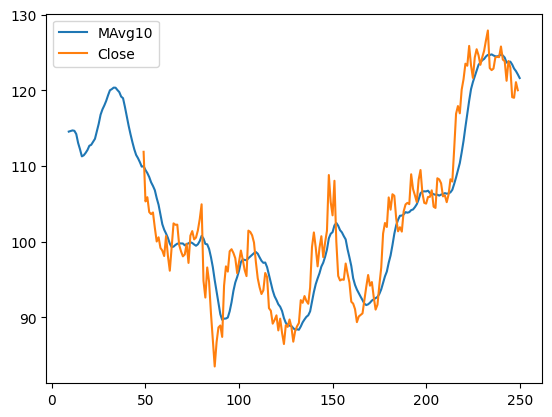
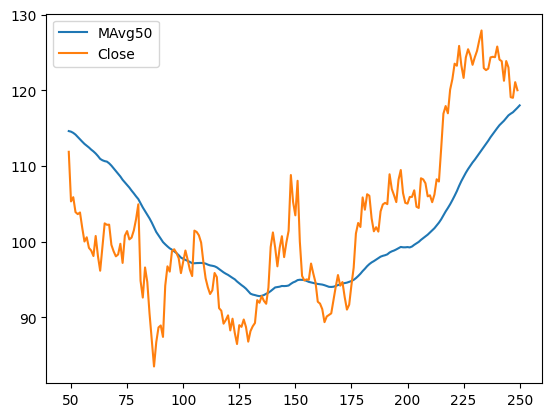
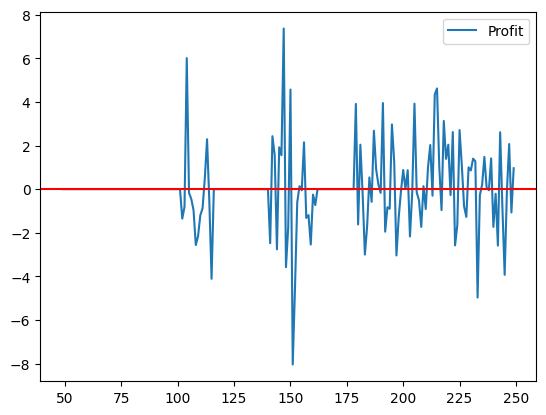
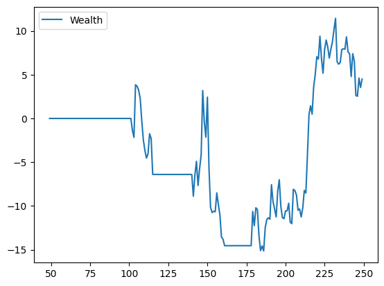

# Simple Trading Strategy

This repository contains a simple Python script for analyzing stock data and implementing a basic trading strategy. The script utilizes the pandas and matplotlib libraries to read and process stock data from a CSV file, calculate moving averages, and generate trading signals based on the moving average crossover strategy.

## Usage

1. Clone the repository to your local machine:

   ```bash
   git clone https://github.com/MustakAbsarKhan/simple_trading_strategy.git
   ```

2. Navigate to the cloned repository:

   ```bash
   cd simple_trading_strategy
   ```

3. Install the required dependencies (pandas and matplotlib). You can use pip to install the dependencies:

   ```bash
   pip install -r requirements.txt
   ```

4. Run the script:

   ```bash
   python trading_strategy.py
   ```

5. Follow the prompts to provide the file path of the stock data CSV file and the desired start and end dates for the analysis.

6. The script will generate three plots:

   - The first plot shows the 10-day moving average (MAvg10) and the close prices of the stock within the specified date range.
   - The second plot shows the 50-day moving average (MAvg50) and the close prices of the stock within the specified date range.
   - The third plot displays the profit generated based on the trading signals derived from the moving average crossover strategy.

## Inputs

When running the script, the following inputs are required:

- File Path: Enter the file path of the stock data CSV file. Make sure the file is in the correct format and contains the necessary columns.
- From Date: Specify the desired start date for the analysis in the format "dd/mm/yyyy".
- Till Date: Specify the desired end date for the analysis in the format "dd/mm/yyyy".

## Output

The script generates three plots using the matplotlib library:

- Plot 1: MAvg10 and Close Prices <br>
  

- Plot 2: MAvg50 and Close Prices <br>
  

- Plot 3: Profit Generated <br>
  

- Plot 4: Wealth Generated <br>
  

The plots provide visual representations of the moving averages and the profit generated based on the trading strategy.

## Contributing

Contributions to the Simple Trading Strategy repository are welcome. If you find any issues or have suggestions for improvements, feel free to open an issue or submit a pull request.

## License

This project is licensed under the MIT License. See the [LICENSE](LICENSE) file for more information.